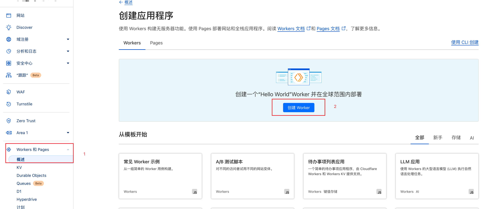
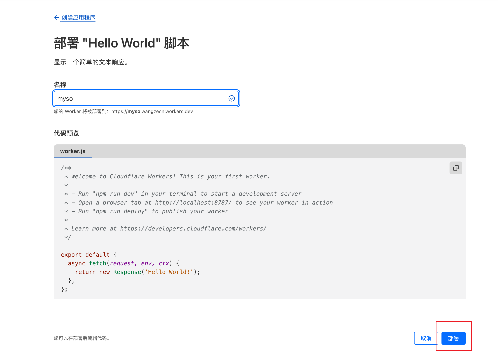
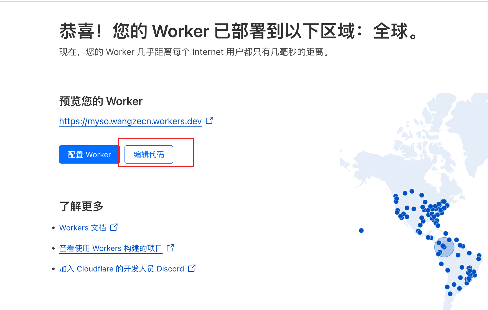
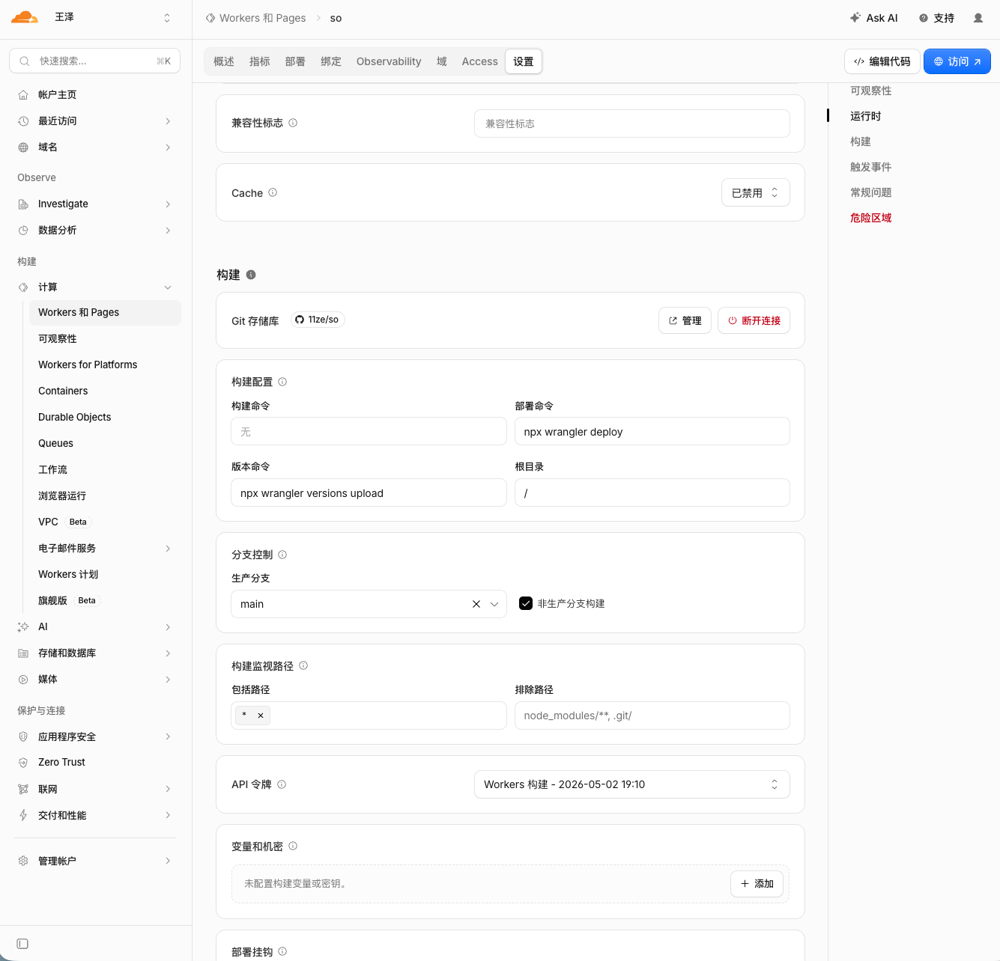

# so

基于 Cloudflare Workers 的搜索聚合站：一次输入，跳转到任意搜索引擎。

## 功能

- 自定义搜索引擎列表（`src/config.js`）
- 搜索历史，数据只存浏览器本地
- 免服务器部署
- 玻璃拟态视觉，跟随系统暗色模式
- 输入验证、输出转义、CSP 等安全防护

## 使用

- 输入关键词，按 Enter 搜索
- 按 `/` 快速聚焦搜索框
- 点击搜索历史项重新搜索
- 可设为浏览器搜索引擎：`https://so.wangze.tech?q=%s`，关键字 `so`（自部署请换成自己的地址）

## 自部署

推荐 clone 后用 wrangler 部署：

```bash
git clone https://github.com/11ze/so.git
cd so
npx wrangler deploy
```

部署完成后拿到访问地址；修改 `src/config.js` 里的搜索引擎列表，再部署一次即可。

也可以在 Cloudflare 控制台操作，流程如下：









部署产物为零构建的单文件 HTML，架构决策见 [docs/adr/0001](docs/adr/0001-零构建单文件产物.md)。

## 开发

### 项目结构

```
so/
├── src/
│   ├── worker.js            # Cloudflare Worker 入口
│   ├── result.js            # 页面组装与服务端渲染
│   ├── template.html        # 页面骨架（含槽位占位符）
│   ├── styles.css           # 页面样式
│   ├── client.js            # 客户端脚本（以文本内联）
│   ├── result.test.js       # 页面渲染测试
│   ├── config.js            # 搜索引擎配置
│   └── utils/
│       ├── security.js      # 安全工具模块
│       ├── security.test.js # 安全测试
│       └── test-harness.js  # 自研最小测试框架（两套测试共用）
├── docs/                    # 文档目录（含 adr/）
├── text-loader.mjs          # 测试专用文本导入 loader（不参与部署）
├── register-text-loader.mjs # 测试入口：注册上面的 loader（不参与部署）
├── SECURITY.md              # 安全策略文档
├── HOW_TO_TEST.md           # 测试说明
├── wrangler.toml            # Wrangler 配置（含文本模块 rules）
└── package.json             # 项目配置
```

### 测试

```bash
npm test
```

包含安全与页面渲染两套测试。手动浏览器测试步骤见 [HOW_TO_TEST.md](HOW_TO_TEST.md)。

### 自定义搜索引擎

编辑 `src/config.js`，添加或修改搜索引擎：

```javascript
{
  name: '搜索引擎名称',
  url: 'https://example.com/search?q=%s',
  icon: 'https://example.com/favicon.ico', // 可选，支持 URL 或 base64
}
```

## 安全性

- 输入验证：关键词长度限制（500 字符）、XSS 模式检测、URL 仅允许 HTTP/HTTPS
- 输出转义：HTML 内容与属性值转义，优先使用 `textContent` 等安全 DOM API
- 安全响应头：CSP、`nosniff`、`X-Frame-Options`、HSTS、`Referrer-Policy`、`Permissions-Policy`
- 本地数据：localStorage 读取验证，损坏数据自动清理

详见 [SECURITY.md](SECURITY.md)。

## 技术栈

- Cloudflare Workers（Serverless）
- 原生 JavaScript，零框架、零构建
- localStorage 存搜索历史

## 许可证

[MIT](LICENSE)
